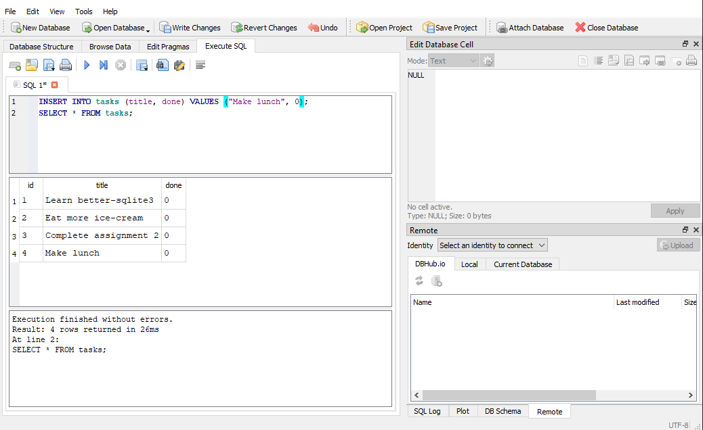
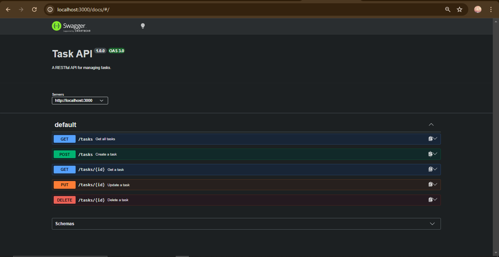

## README.md

# Task API

A RESTful CRUD API for managing tasks with SQLite persistence.

## Why SQLite?

- **Single file** – Entire database is one file (`tasks.db`)
- **Zero setup** – No separate database server needed
- **Survives restarts** – Data persists after server restarts

## Quick Start

```bash
npm install
node index.js
```

Server runs at `http://localhost:3000`

## Database

- **File:** `tasks.db` (created automatically on first run)
- **Git ignored** – Each fresh clone starts clean
- **View with:** [DB Browser for SQLite](https://sqlitebrowser.org/)



### Seeded Data

On first run, three example tasks are created:
1. Learn better-sqlite3
2. Eat more ice-cream
3. Complete assignment 2

### Example SQL Query

```sql
SELECT * FROM tasks WHERE done = 0;
```

Returns all incomplete tasks.

## API Endpoints

| Method | Endpoint | Description |
|--------|----------|-------------|
| GET | `/tasks` | Get all tasks |
| GET | `/tasks/:id` | Get one task |
| POST | `/tasks` | Create a task |
| PUT | `/tasks/:id` | Update a task |
| DELETE | `/tasks/:id` | Delete a task |

## API Documentation

Interactive Swagger UI documentation is available at `http://localhost:3000/docs`



## Examples

### Create a task
```bash
curl -X POST http://localhost:3000/tasks \
  -H "Content-Type: application/json" \
  -d '{"title":"Learn SQL"}'
```

### Get all tasks
```bash
curl http://localhost:3000/tasks
```

### Get a specific task
```bash
curl http://localhost:3000/tasks/1
```

### Update a task
```bash
curl -X PUT http://localhost:3000/tasks/1 \
  -H "Content-Type: application/json" \
  -d '{"done":true}'
```

### Delete a task
```bash
curl -X DELETE http://localhost:3000/tasks/1
```

## PowerShell Users

Use `Invoke-RestMethod` instead of `curl`:

```powershell
# Create a task
Invoke-RestMethod -Method POST -Uri http://localhost:3000/tasks -ContentType "application/json" -Body '{"title":"Buy milk"}'

# Get all tasks
Invoke-RestMethod -Method GET -Uri http://localhost:3000/tasks

# Update a task
Invoke-RestMethod -Method PUT -Uri http://localhost:3000/tasks/1 -ContentType "application/json" -Body '{"done":true}'

# Delete a task
Invoke-RestMethod -Method DELETE -Uri http://localhost:3000/tasks/1
```

## Tech Stack

- Node.js + Express
- better-sqlite3
- Swagger UI